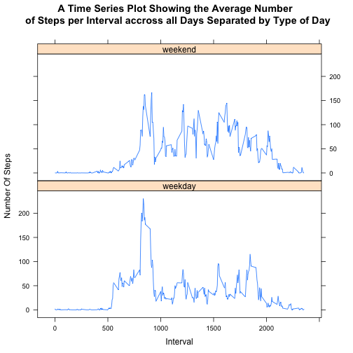

Reproducible Research : Peer Assessment 1  
========================================================


First we need to load and preprocess the data 


```r
# Read in csv file
data <- read.csv("activity.csv", header = TRUE)
# Convert date column to Date format
data$date <- as.Date(data$date)
```


## What is the mean total number of steps taken per day? 

The following histogram shows the total number of steps each day:


```r
# Use tapply to split the steps for each date and then sum
totalSteps <- tapply(data$steps, data$date, sum, na.rm = TRUE)
# Plot a histogram
hist(totalSteps, breaks = 20, main = "Histogram of the Total Number of Steps Taken Each Day", 
    xlab = "Number of Steps")
```

 


The following table shows the **mean** number of steps taken each day:


```r
# Use tapply to split the steps for each date and then calculate the mean
meanSteps <- tapply(data$steps, data$date, mean, na.rm = TRUE)
# Display as table
library(xtable)
result <- data.frame(meanSteps)
names(result) <- c("Mean Steps")
meanTable <- xtable(result)
print(meanTable, type = "html")
```

<!-- html table generated in R 3.1.0 by xtable 1.7-3 package -->
<!-- Sun May 18 13:08:39 2014 -->
<TABLE border=1>
<TR> <TH>  </TH> <TH> Mean Steps </TH>  </TR>
  <TR> <TD align="right"> 2012-10-01 </TD> <TD align="right">  </TD> </TR>
  <TR> <TD align="right"> 2012-10-02 </TD> <TD align="right"> 0.44 </TD> </TR>
  <TR> <TD align="right"> 2012-10-03 </TD> <TD align="right"> 39.42 </TD> </TR>
  <TR> <TD align="right"> 2012-10-04 </TD> <TD align="right"> 42.07 </TD> </TR>
  <TR> <TD align="right"> 2012-10-05 </TD> <TD align="right"> 46.16 </TD> </TR>
  <TR> <TD align="right"> 2012-10-06 </TD> <TD align="right"> 53.54 </TD> </TR>
  <TR> <TD align="right"> 2012-10-07 </TD> <TD align="right"> 38.25 </TD> </TR>
  <TR> <TD align="right"> 2012-10-08 </TD> <TD align="right">  </TD> </TR>
  <TR> <TD align="right"> 2012-10-09 </TD> <TD align="right"> 44.48 </TD> </TR>
  <TR> <TD align="right"> 2012-10-10 </TD> <TD align="right"> 34.38 </TD> </TR>
  <TR> <TD align="right"> 2012-10-11 </TD> <TD align="right"> 35.78 </TD> </TR>
  <TR> <TD align="right"> 2012-10-12 </TD> <TD align="right"> 60.35 </TD> </TR>
  <TR> <TD align="right"> 2012-10-13 </TD> <TD align="right"> 43.15 </TD> </TR>
  <TR> <TD align="right"> 2012-10-14 </TD> <TD align="right"> 52.42 </TD> </TR>
  <TR> <TD align="right"> 2012-10-15 </TD> <TD align="right"> 35.20 </TD> </TR>
  <TR> <TD align="right"> 2012-10-16 </TD> <TD align="right"> 52.38 </TD> </TR>
  <TR> <TD align="right"> 2012-10-17 </TD> <TD align="right"> 46.71 </TD> </TR>
  <TR> <TD align="right"> 2012-10-18 </TD> <TD align="right"> 34.92 </TD> </TR>
  <TR> <TD align="right"> 2012-10-19 </TD> <TD align="right"> 41.07 </TD> </TR>
  <TR> <TD align="right"> 2012-10-20 </TD> <TD align="right"> 36.09 </TD> </TR>
  <TR> <TD align="right"> 2012-10-21 </TD> <TD align="right"> 30.63 </TD> </TR>
  <TR> <TD align="right"> 2012-10-22 </TD> <TD align="right"> 46.74 </TD> </TR>
  <TR> <TD align="right"> 2012-10-23 </TD> <TD align="right"> 30.97 </TD> </TR>
  <TR> <TD align="right"> 2012-10-24 </TD> <TD align="right"> 29.01 </TD> </TR>
  <TR> <TD align="right"> 2012-10-25 </TD> <TD align="right"> 8.65 </TD> </TR>
  <TR> <TD align="right"> 2012-10-26 </TD> <TD align="right"> 23.53 </TD> </TR>
  <TR> <TD align="right"> 2012-10-27 </TD> <TD align="right"> 35.14 </TD> </TR>
  <TR> <TD align="right"> 2012-10-28 </TD> <TD align="right"> 39.78 </TD> </TR>
  <TR> <TD align="right"> 2012-10-29 </TD> <TD align="right"> 17.42 </TD> </TR>
  <TR> <TD align="right"> 2012-10-30 </TD> <TD align="right"> 34.09 </TD> </TR>
  <TR> <TD align="right"> 2012-10-31 </TD> <TD align="right"> 53.52 </TD> </TR>
  <TR> <TD align="right"> 2012-11-01 </TD> <TD align="right">  </TD> </TR>
  <TR> <TD align="right"> 2012-11-02 </TD> <TD align="right"> 36.81 </TD> </TR>
  <TR> <TD align="right"> 2012-11-03 </TD> <TD align="right"> 36.70 </TD> </TR>
  <TR> <TD align="right"> 2012-11-04 </TD> <TD align="right">  </TD> </TR>
  <TR> <TD align="right"> 2012-11-05 </TD> <TD align="right"> 36.25 </TD> </TR>
  <TR> <TD align="right"> 2012-11-06 </TD> <TD align="right"> 28.94 </TD> </TR>
  <TR> <TD align="right"> 2012-11-07 </TD> <TD align="right"> 44.73 </TD> </TR>
  <TR> <TD align="right"> 2012-11-08 </TD> <TD align="right"> 11.18 </TD> </TR>
  <TR> <TD align="right"> 2012-11-09 </TD> <TD align="right">  </TD> </TR>
  <TR> <TD align="right"> 2012-11-10 </TD> <TD align="right">  </TD> </TR>
  <TR> <TD align="right"> 2012-11-11 </TD> <TD align="right"> 43.78 </TD> </TR>
  <TR> <TD align="right"> 2012-11-12 </TD> <TD align="right"> 37.38 </TD> </TR>
  <TR> <TD align="right"> 2012-11-13 </TD> <TD align="right"> 25.47 </TD> </TR>
  <TR> <TD align="right"> 2012-11-14 </TD> <TD align="right">  </TD> </TR>
  <TR> <TD align="right"> 2012-11-15 </TD> <TD align="right"> 0.14 </TD> </TR>
  <TR> <TD align="right"> 2012-11-16 </TD> <TD align="right"> 18.89 </TD> </TR>
  <TR> <TD align="right"> 2012-11-17 </TD> <TD align="right"> 49.79 </TD> </TR>
  <TR> <TD align="right"> 2012-11-18 </TD> <TD align="right"> 52.47 </TD> </TR>
  <TR> <TD align="right"> 2012-11-19 </TD> <TD align="right"> 30.70 </TD> </TR>
  <TR> <TD align="right"> 2012-11-20 </TD> <TD align="right"> 15.53 </TD> </TR>
  <TR> <TD align="right"> 2012-11-21 </TD> <TD align="right"> 44.40 </TD> </TR>
  <TR> <TD align="right"> 2012-11-22 </TD> <TD align="right"> 70.93 </TD> </TR>
  <TR> <TD align="right"> 2012-11-23 </TD> <TD align="right"> 73.59 </TD> </TR>
  <TR> <TD align="right"> 2012-11-24 </TD> <TD align="right"> 50.27 </TD> </TR>
  <TR> <TD align="right"> 2012-11-25 </TD> <TD align="right"> 41.09 </TD> </TR>
  <TR> <TD align="right"> 2012-11-26 </TD> <TD align="right"> 38.76 </TD> </TR>
  <TR> <TD align="right"> 2012-11-27 </TD> <TD align="right"> 47.38 </TD> </TR>
  <TR> <TD align="right"> 2012-11-28 </TD> <TD align="right"> 35.36 </TD> </TR>
  <TR> <TD align="right"> 2012-11-29 </TD> <TD align="right"> 24.47 </TD> </TR>
  <TR> <TD align="right"> 2012-11-30 </TD> <TD align="right">  </TD> </TR>
   </TABLE>


The following table shows the **median** number of steps taken each day:


```r
# Use tapply to split the steps for each date and then calculate the median
medianSteps <- tapply(data$steps, data$date, median, na.rm = TRUE)
# Display as table
library(xtable)
result <- data.frame(medianSteps)
names(result) <- c("Median Steps")
medianTable <- xtable(result)
print(medianTable, type = "html")
```

<!-- html table generated in R 3.1.0 by xtable 1.7-3 package -->
<!-- Sun May 18 13:08:39 2014 -->
<TABLE border=1>
<TR> <TH>  </TH> <TH> Median Steps </TH>  </TR>
  <TR> <TD align="right"> 2012-10-01 </TD> <TD align="right">  </TD> </TR>
  <TR> <TD align="right"> 2012-10-02 </TD> <TD align="right"> 0.00 </TD> </TR>
  <TR> <TD align="right"> 2012-10-03 </TD> <TD align="right"> 0.00 </TD> </TR>
  <TR> <TD align="right"> 2012-10-04 </TD> <TD align="right"> 0.00 </TD> </TR>
  <TR> <TD align="right"> 2012-10-05 </TD> <TD align="right"> 0.00 </TD> </TR>
  <TR> <TD align="right"> 2012-10-06 </TD> <TD align="right"> 0.00 </TD> </TR>
  <TR> <TD align="right"> 2012-10-07 </TD> <TD align="right"> 0.00 </TD> </TR>
  <TR> <TD align="right"> 2012-10-08 </TD> <TD align="right">  </TD> </TR>
  <TR> <TD align="right"> 2012-10-09 </TD> <TD align="right"> 0.00 </TD> </TR>
  <TR> <TD align="right"> 2012-10-10 </TD> <TD align="right"> 0.00 </TD> </TR>
  <TR> <TD align="right"> 2012-10-11 </TD> <TD align="right"> 0.00 </TD> </TR>
  <TR> <TD align="right"> 2012-10-12 </TD> <TD align="right"> 0.00 </TD> </TR>
  <TR> <TD align="right"> 2012-10-13 </TD> <TD align="right"> 0.00 </TD> </TR>
  <TR> <TD align="right"> 2012-10-14 </TD> <TD align="right"> 0.00 </TD> </TR>
  <TR> <TD align="right"> 2012-10-15 </TD> <TD align="right"> 0.00 </TD> </TR>
  <TR> <TD align="right"> 2012-10-16 </TD> <TD align="right"> 0.00 </TD> </TR>
  <TR> <TD align="right"> 2012-10-17 </TD> <TD align="right"> 0.00 </TD> </TR>
  <TR> <TD align="right"> 2012-10-18 </TD> <TD align="right"> 0.00 </TD> </TR>
  <TR> <TD align="right"> 2012-10-19 </TD> <TD align="right"> 0.00 </TD> </TR>
  <TR> <TD align="right"> 2012-10-20 </TD> <TD align="right"> 0.00 </TD> </TR>
  <TR> <TD align="right"> 2012-10-21 </TD> <TD align="right"> 0.00 </TD> </TR>
  <TR> <TD align="right"> 2012-10-22 </TD> <TD align="right"> 0.00 </TD> </TR>
  <TR> <TD align="right"> 2012-10-23 </TD> <TD align="right"> 0.00 </TD> </TR>
  <TR> <TD align="right"> 2012-10-24 </TD> <TD align="right"> 0.00 </TD> </TR>
  <TR> <TD align="right"> 2012-10-25 </TD> <TD align="right"> 0.00 </TD> </TR>
  <TR> <TD align="right"> 2012-10-26 </TD> <TD align="right"> 0.00 </TD> </TR>
  <TR> <TD align="right"> 2012-10-27 </TD> <TD align="right"> 0.00 </TD> </TR>
  <TR> <TD align="right"> 2012-10-28 </TD> <TD align="right"> 0.00 </TD> </TR>
  <TR> <TD align="right"> 2012-10-29 </TD> <TD align="right"> 0.00 </TD> </TR>
  <TR> <TD align="right"> 2012-10-30 </TD> <TD align="right"> 0.00 </TD> </TR>
  <TR> <TD align="right"> 2012-10-31 </TD> <TD align="right"> 0.00 </TD> </TR>
  <TR> <TD align="right"> 2012-11-01 </TD> <TD align="right">  </TD> </TR>
  <TR> <TD align="right"> 2012-11-02 </TD> <TD align="right"> 0.00 </TD> </TR>
  <TR> <TD align="right"> 2012-11-03 </TD> <TD align="right"> 0.00 </TD> </TR>
  <TR> <TD align="right"> 2012-11-04 </TD> <TD align="right">  </TD> </TR>
  <TR> <TD align="right"> 2012-11-05 </TD> <TD align="right"> 0.00 </TD> </TR>
  <TR> <TD align="right"> 2012-11-06 </TD> <TD align="right"> 0.00 </TD> </TR>
  <TR> <TD align="right"> 2012-11-07 </TD> <TD align="right"> 0.00 </TD> </TR>
  <TR> <TD align="right"> 2012-11-08 </TD> <TD align="right"> 0.00 </TD> </TR>
  <TR> <TD align="right"> 2012-11-09 </TD> <TD align="right">  </TD> </TR>
  <TR> <TD align="right"> 2012-11-10 </TD> <TD align="right">  </TD> </TR>
  <TR> <TD align="right"> 2012-11-11 </TD> <TD align="right"> 0.00 </TD> </TR>
  <TR> <TD align="right"> 2012-11-12 </TD> <TD align="right"> 0.00 </TD> </TR>
  <TR> <TD align="right"> 2012-11-13 </TD> <TD align="right"> 0.00 </TD> </TR>
  <TR> <TD align="right"> 2012-11-14 </TD> <TD align="right">  </TD> </TR>
  <TR> <TD align="right"> 2012-11-15 </TD> <TD align="right"> 0.00 </TD> </TR>
  <TR> <TD align="right"> 2012-11-16 </TD> <TD align="right"> 0.00 </TD> </TR>
  <TR> <TD align="right"> 2012-11-17 </TD> <TD align="right"> 0.00 </TD> </TR>
  <TR> <TD align="right"> 2012-11-18 </TD> <TD align="right"> 0.00 </TD> </TR>
  <TR> <TD align="right"> 2012-11-19 </TD> <TD align="right"> 0.00 </TD> </TR>
  <TR> <TD align="right"> 2012-11-20 </TD> <TD align="right"> 0.00 </TD> </TR>
  <TR> <TD align="right"> 2012-11-21 </TD> <TD align="right"> 0.00 </TD> </TR>
  <TR> <TD align="right"> 2012-11-22 </TD> <TD align="right"> 0.00 </TD> </TR>
  <TR> <TD align="right"> 2012-11-23 </TD> <TD align="right"> 0.00 </TD> </TR>
  <TR> <TD align="right"> 2012-11-24 </TD> <TD align="right"> 0.00 </TD> </TR>
  <TR> <TD align="right"> 2012-11-25 </TD> <TD align="right"> 0.00 </TD> </TR>
  <TR> <TD align="right"> 2012-11-26 </TD> <TD align="right"> 0.00 </TD> </TR>
  <TR> <TD align="right"> 2012-11-27 </TD> <TD align="right"> 0.00 </TD> </TR>
  <TR> <TD align="right"> 2012-11-28 </TD> <TD align="right"> 0.00 </TD> </TR>
  <TR> <TD align="right"> 2012-11-29 </TD> <TD align="right"> 0.00 </TD> </TR>
  <TR> <TD align="right"> 2012-11-30 </TD> <TD align="right">  </TD> </TR>
   </TABLE>


## What is the average daily activity pattern?

The following time-series plot shows the 5-minute interval and the average number of steps taken, averaged accross all of the days:


```r
# Split data into days
days <- split(data, data$date)
# Iterate over the intervals
intervalDayAverage <- c()
for (i in 1:288) {
    # For each interval create a vector
    row <- c()
    # Iterate over the days
    for (j in 1:61) {
        # For each day, populate the interval vector with the number of steps for
        # that day
        row[j] <- days[[j]][i, 1]
    }
    # Average over the number of steps for each interval for each day
    rowMean <- mean(row, na.rm = TRUE)
    # Add this value to the total vector which contains the average number of
    # steps taken averaged accross all of the days
    intervalDayAverage[i] <- rowMean
}
# Turn the data into timeseries data
tsData <- ts(intervalDayAverage, )
# Plot the data
intervals <- data[1:288, 3]
plot(intervals, tsData, type = "l", xlab = "Interval", ylab = "Average Step Count", 
    main = "A Time Series Plot Showing the Average \n Number of Steps per Interval accross all Days")
```

 


The 5-minute interval which, on average across all the days in the dataset, contains the maximum number of steps is interval number **104**.

## Imputing missing values

The total number of missing values in the dataset is **2304**.

Now we fill in the missing values.

**In order to fill in the missing values we use the average value for that 5-minute interval number, averaged across all of the days.**


```r
daysNew <- split(data, data$date)
# Loop over the days in the split dataset
for (i in 1:61) {
    # Loop over the intervals in each day
    for (j in 1:288) {
        # For each interval, if the value is NA
        if (is.na(daysNew[[i]][j, 1])) {
            # Then replace the value with the average value for that interval across all
            # days
            daysNew[[i]][j, 1] <- intervalDayAverage[j]
        }
    }
}
# Reform the data back into its original form
dataNew <- unsplit(daysNew, data$date)
```


The following histogram shows the total number of steps each day for the new data:


```r
# Use tapply to split the steps for each date and then sum
totalStepsNew <- tapply(dataNew$steps, dataNew$date, sum, na.rm = TRUE)
# Plot a histogram
hist(totalStepsNew, breaks = 20, main = "Histogram of the Total Number of Steps Taken Each Day", 
    xlab = "Number of Steps")
```

 


The following table shows the **mean** number of steps taken each day for the new data:


```r
# Use tapply to split the steps for each date and then calculate the mean
meanStepsNew <- tapply(dataNew$steps, dataNew$date, mean, na.rm = TRUE)
# Display as table
library(xtable)
result <- data.frame(meanStepsNew)
names(result) <- c("Mean Steps")
meanTableNew <- xtable(result)
print(meanTableNew, type = "html")
```

<!-- html table generated in R 3.1.0 by xtable 1.7-3 package -->
<!-- Sun May 18 13:08:41 2014 -->
<TABLE border=1>
<TR> <TH>  </TH> <TH> Mean Steps </TH>  </TR>
  <TR> <TD align="right"> 2012-10-01 </TD> <TD align="right"> 37.38 </TD> </TR>
  <TR> <TD align="right"> 2012-10-02 </TD> <TD align="right"> 0.44 </TD> </TR>
  <TR> <TD align="right"> 2012-10-03 </TD> <TD align="right"> 39.42 </TD> </TR>
  <TR> <TD align="right"> 2012-10-04 </TD> <TD align="right"> 42.07 </TD> </TR>
  <TR> <TD align="right"> 2012-10-05 </TD> <TD align="right"> 46.16 </TD> </TR>
  <TR> <TD align="right"> 2012-10-06 </TD> <TD align="right"> 53.54 </TD> </TR>
  <TR> <TD align="right"> 2012-10-07 </TD> <TD align="right"> 38.25 </TD> </TR>
  <TR> <TD align="right"> 2012-10-08 </TD> <TD align="right"> 37.38 </TD> </TR>
  <TR> <TD align="right"> 2012-10-09 </TD> <TD align="right"> 44.48 </TD> </TR>
  <TR> <TD align="right"> 2012-10-10 </TD> <TD align="right"> 34.38 </TD> </TR>
  <TR> <TD align="right"> 2012-10-11 </TD> <TD align="right"> 35.78 </TD> </TR>
  <TR> <TD align="right"> 2012-10-12 </TD> <TD align="right"> 60.35 </TD> </TR>
  <TR> <TD align="right"> 2012-10-13 </TD> <TD align="right"> 43.15 </TD> </TR>
  <TR> <TD align="right"> 2012-10-14 </TD> <TD align="right"> 52.42 </TD> </TR>
  <TR> <TD align="right"> 2012-10-15 </TD> <TD align="right"> 35.20 </TD> </TR>
  <TR> <TD align="right"> 2012-10-16 </TD> <TD align="right"> 52.38 </TD> </TR>
  <TR> <TD align="right"> 2012-10-17 </TD> <TD align="right"> 46.71 </TD> </TR>
  <TR> <TD align="right"> 2012-10-18 </TD> <TD align="right"> 34.92 </TD> </TR>
  <TR> <TD align="right"> 2012-10-19 </TD> <TD align="right"> 41.07 </TD> </TR>
  <TR> <TD align="right"> 2012-10-20 </TD> <TD align="right"> 36.09 </TD> </TR>
  <TR> <TD align="right"> 2012-10-21 </TD> <TD align="right"> 30.63 </TD> </TR>
  <TR> <TD align="right"> 2012-10-22 </TD> <TD align="right"> 46.74 </TD> </TR>
  <TR> <TD align="right"> 2012-10-23 </TD> <TD align="right"> 30.97 </TD> </TR>
  <TR> <TD align="right"> 2012-10-24 </TD> <TD align="right"> 29.01 </TD> </TR>
  <TR> <TD align="right"> 2012-10-25 </TD> <TD align="right"> 8.65 </TD> </TR>
  <TR> <TD align="right"> 2012-10-26 </TD> <TD align="right"> 23.53 </TD> </TR>
  <TR> <TD align="right"> 2012-10-27 </TD> <TD align="right"> 35.14 </TD> </TR>
  <TR> <TD align="right"> 2012-10-28 </TD> <TD align="right"> 39.78 </TD> </TR>
  <TR> <TD align="right"> 2012-10-29 </TD> <TD align="right"> 17.42 </TD> </TR>
  <TR> <TD align="right"> 2012-10-30 </TD> <TD align="right"> 34.09 </TD> </TR>
  <TR> <TD align="right"> 2012-10-31 </TD> <TD align="right"> 53.52 </TD> </TR>
  <TR> <TD align="right"> 2012-11-01 </TD> <TD align="right"> 37.38 </TD> </TR>
  <TR> <TD align="right"> 2012-11-02 </TD> <TD align="right"> 36.81 </TD> </TR>
  <TR> <TD align="right"> 2012-11-03 </TD> <TD align="right"> 36.70 </TD> </TR>
  <TR> <TD align="right"> 2012-11-04 </TD> <TD align="right"> 37.38 </TD> </TR>
  <TR> <TD align="right"> 2012-11-05 </TD> <TD align="right"> 36.25 </TD> </TR>
  <TR> <TD align="right"> 2012-11-06 </TD> <TD align="right"> 28.94 </TD> </TR>
  <TR> <TD align="right"> 2012-11-07 </TD> <TD align="right"> 44.73 </TD> </TR>
  <TR> <TD align="right"> 2012-11-08 </TD> <TD align="right"> 11.18 </TD> </TR>
  <TR> <TD align="right"> 2012-11-09 </TD> <TD align="right"> 37.38 </TD> </TR>
  <TR> <TD align="right"> 2012-11-10 </TD> <TD align="right"> 37.38 </TD> </TR>
  <TR> <TD align="right"> 2012-11-11 </TD> <TD align="right"> 43.78 </TD> </TR>
  <TR> <TD align="right"> 2012-11-12 </TD> <TD align="right"> 37.38 </TD> </TR>
  <TR> <TD align="right"> 2012-11-13 </TD> <TD align="right"> 25.47 </TD> </TR>
  <TR> <TD align="right"> 2012-11-14 </TD> <TD align="right"> 37.38 </TD> </TR>
  <TR> <TD align="right"> 2012-11-15 </TD> <TD align="right"> 0.14 </TD> </TR>
  <TR> <TD align="right"> 2012-11-16 </TD> <TD align="right"> 18.89 </TD> </TR>
  <TR> <TD align="right"> 2012-11-17 </TD> <TD align="right"> 49.79 </TD> </TR>
  <TR> <TD align="right"> 2012-11-18 </TD> <TD align="right"> 52.47 </TD> </TR>
  <TR> <TD align="right"> 2012-11-19 </TD> <TD align="right"> 30.70 </TD> </TR>
  <TR> <TD align="right"> 2012-11-20 </TD> <TD align="right"> 15.53 </TD> </TR>
  <TR> <TD align="right"> 2012-11-21 </TD> <TD align="right"> 44.40 </TD> </TR>
  <TR> <TD align="right"> 2012-11-22 </TD> <TD align="right"> 70.93 </TD> </TR>
  <TR> <TD align="right"> 2012-11-23 </TD> <TD align="right"> 73.59 </TD> </TR>
  <TR> <TD align="right"> 2012-11-24 </TD> <TD align="right"> 50.27 </TD> </TR>
  <TR> <TD align="right"> 2012-11-25 </TD> <TD align="right"> 41.09 </TD> </TR>
  <TR> <TD align="right"> 2012-11-26 </TD> <TD align="right"> 38.76 </TD> </TR>
  <TR> <TD align="right"> 2012-11-27 </TD> <TD align="right"> 47.38 </TD> </TR>
  <TR> <TD align="right"> 2012-11-28 </TD> <TD align="right"> 35.36 </TD> </TR>
  <TR> <TD align="right"> 2012-11-29 </TD> <TD align="right"> 24.47 </TD> </TR>
  <TR> <TD align="right"> 2012-11-30 </TD> <TD align="right"> 37.38 </TD> </TR>
   </TABLE>


The following table shows the **median** number of steps taken each day for the new data:


```r
# Use tapply to split the steps for each date and then calculate the median
medianStepsNew <- tapply(dataNew$steps, dataNew$date, median, na.rm = TRUE)
# Display as table
library(xtable)
result <- data.frame(medianStepsNew)
names(result) <- c("Median Steps")
medianTableNew <- xtable(result)
print(medianTableNew, type = "html")
```

<!-- html table generated in R 3.1.0 by xtable 1.7-3 package -->
<!-- Sun May 18 13:08:41 2014 -->
<TABLE border=1>
<TR> <TH>  </TH> <TH> Median Steps </TH>  </TR>
  <TR> <TD align="right"> 2012-10-01 </TD> <TD align="right"> 34.11 </TD> </TR>
  <TR> <TD align="right"> 2012-10-02 </TD> <TD align="right"> 0.00 </TD> </TR>
  <TR> <TD align="right"> 2012-10-03 </TD> <TD align="right"> 0.00 </TD> </TR>
  <TR> <TD align="right"> 2012-10-04 </TD> <TD align="right"> 0.00 </TD> </TR>
  <TR> <TD align="right"> 2012-10-05 </TD> <TD align="right"> 0.00 </TD> </TR>
  <TR> <TD align="right"> 2012-10-06 </TD> <TD align="right"> 0.00 </TD> </TR>
  <TR> <TD align="right"> 2012-10-07 </TD> <TD align="right"> 0.00 </TD> </TR>
  <TR> <TD align="right"> 2012-10-08 </TD> <TD align="right"> 34.11 </TD> </TR>
  <TR> <TD align="right"> 2012-10-09 </TD> <TD align="right"> 0.00 </TD> </TR>
  <TR> <TD align="right"> 2012-10-10 </TD> <TD align="right"> 0.00 </TD> </TR>
  <TR> <TD align="right"> 2012-10-11 </TD> <TD align="right"> 0.00 </TD> </TR>
  <TR> <TD align="right"> 2012-10-12 </TD> <TD align="right"> 0.00 </TD> </TR>
  <TR> <TD align="right"> 2012-10-13 </TD> <TD align="right"> 0.00 </TD> </TR>
  <TR> <TD align="right"> 2012-10-14 </TD> <TD align="right"> 0.00 </TD> </TR>
  <TR> <TD align="right"> 2012-10-15 </TD> <TD align="right"> 0.00 </TD> </TR>
  <TR> <TD align="right"> 2012-10-16 </TD> <TD align="right"> 0.00 </TD> </TR>
  <TR> <TD align="right"> 2012-10-17 </TD> <TD align="right"> 0.00 </TD> </TR>
  <TR> <TD align="right"> 2012-10-18 </TD> <TD align="right"> 0.00 </TD> </TR>
  <TR> <TD align="right"> 2012-10-19 </TD> <TD align="right"> 0.00 </TD> </TR>
  <TR> <TD align="right"> 2012-10-20 </TD> <TD align="right"> 0.00 </TD> </TR>
  <TR> <TD align="right"> 2012-10-21 </TD> <TD align="right"> 0.00 </TD> </TR>
  <TR> <TD align="right"> 2012-10-22 </TD> <TD align="right"> 0.00 </TD> </TR>
  <TR> <TD align="right"> 2012-10-23 </TD> <TD align="right"> 0.00 </TD> </TR>
  <TR> <TD align="right"> 2012-10-24 </TD> <TD align="right"> 0.00 </TD> </TR>
  <TR> <TD align="right"> 2012-10-25 </TD> <TD align="right"> 0.00 </TD> </TR>
  <TR> <TD align="right"> 2012-10-26 </TD> <TD align="right"> 0.00 </TD> </TR>
  <TR> <TD align="right"> 2012-10-27 </TD> <TD align="right"> 0.00 </TD> </TR>
  <TR> <TD align="right"> 2012-10-28 </TD> <TD align="right"> 0.00 </TD> </TR>
  <TR> <TD align="right"> 2012-10-29 </TD> <TD align="right"> 0.00 </TD> </TR>
  <TR> <TD align="right"> 2012-10-30 </TD> <TD align="right"> 0.00 </TD> </TR>
  <TR> <TD align="right"> 2012-10-31 </TD> <TD align="right"> 0.00 </TD> </TR>
  <TR> <TD align="right"> 2012-11-01 </TD> <TD align="right"> 34.11 </TD> </TR>
  <TR> <TD align="right"> 2012-11-02 </TD> <TD align="right"> 0.00 </TD> </TR>
  <TR> <TD align="right"> 2012-11-03 </TD> <TD align="right"> 0.00 </TD> </TR>
  <TR> <TD align="right"> 2012-11-04 </TD> <TD align="right"> 34.11 </TD> </TR>
  <TR> <TD align="right"> 2012-11-05 </TD> <TD align="right"> 0.00 </TD> </TR>
  <TR> <TD align="right"> 2012-11-06 </TD> <TD align="right"> 0.00 </TD> </TR>
  <TR> <TD align="right"> 2012-11-07 </TD> <TD align="right"> 0.00 </TD> </TR>
  <TR> <TD align="right"> 2012-11-08 </TD> <TD align="right"> 0.00 </TD> </TR>
  <TR> <TD align="right"> 2012-11-09 </TD> <TD align="right"> 34.11 </TD> </TR>
  <TR> <TD align="right"> 2012-11-10 </TD> <TD align="right"> 34.11 </TD> </TR>
  <TR> <TD align="right"> 2012-11-11 </TD> <TD align="right"> 0.00 </TD> </TR>
  <TR> <TD align="right"> 2012-11-12 </TD> <TD align="right"> 0.00 </TD> </TR>
  <TR> <TD align="right"> 2012-11-13 </TD> <TD align="right"> 0.00 </TD> </TR>
  <TR> <TD align="right"> 2012-11-14 </TD> <TD align="right"> 34.11 </TD> </TR>
  <TR> <TD align="right"> 2012-11-15 </TD> <TD align="right"> 0.00 </TD> </TR>
  <TR> <TD align="right"> 2012-11-16 </TD> <TD align="right"> 0.00 </TD> </TR>
  <TR> <TD align="right"> 2012-11-17 </TD> <TD align="right"> 0.00 </TD> </TR>
  <TR> <TD align="right"> 2012-11-18 </TD> <TD align="right"> 0.00 </TD> </TR>
  <TR> <TD align="right"> 2012-11-19 </TD> <TD align="right"> 0.00 </TD> </TR>
  <TR> <TD align="right"> 2012-11-20 </TD> <TD align="right"> 0.00 </TD> </TR>
  <TR> <TD align="right"> 2012-11-21 </TD> <TD align="right"> 0.00 </TD> </TR>
  <TR> <TD align="right"> 2012-11-22 </TD> <TD align="right"> 0.00 </TD> </TR>
  <TR> <TD align="right"> 2012-11-23 </TD> <TD align="right"> 0.00 </TD> </TR>
  <TR> <TD align="right"> 2012-11-24 </TD> <TD align="right"> 0.00 </TD> </TR>
  <TR> <TD align="right"> 2012-11-25 </TD> <TD align="right"> 0.00 </TD> </TR>
  <TR> <TD align="right"> 2012-11-26 </TD> <TD align="right"> 0.00 </TD> </TR>
  <TR> <TD align="right"> 2012-11-27 </TD> <TD align="right"> 0.00 </TD> </TR>
  <TR> <TD align="right"> 2012-11-28 </TD> <TD align="right"> 0.00 </TD> </TR>
  <TR> <TD align="right"> 2012-11-29 </TD> <TD align="right"> 0.00 </TD> </TR>
  <TR> <TD align="right"> 2012-11-30 </TD> <TD align="right"> 34.11 </TD> </TR>
   </TABLE>


Conclusions: 

**_When looking at the histogram, imputing the missing values clearly has an effect on the spread of the data, as there is less of a focus around 0 and the distribution looks more Gaussian. For the days in which NA values were present, the mean and median values are now available, with values for other days staying the same. Though for this example, as it was the case that if NAs were present it was throughout a whole day, and we have replaced NA's with the average accross the days, the mean and median values are the same for each day with NAs present._**

## Are there differences in activity patterns between weekdays and weekends?

First we create a new factor variable in the dataset indicating whethere or not it is a weekday or weekend. Then we seperate the data into two datasets, one for the weekdays and one for weekends: 


```r
# Create a character vector containing the days of the week
daylist <- c("Monday", "Tuesday", "Wednesday", "Thursday", "Friday")
# Loop over rows in the new data set
for (i in 1:nrow(dataNew)) {
    # If the date matches a day in the character vector above
    if (weekdays(dataNew[i, 2]) %in% daylist) {
        # Label it as a weekday
        dataNew$dayType[i] <- "weekday"
        # If not
    } else {
        # Label it as a weekend
        dataNew$dayType[i] <- "weekend"
    }
}

# Split the data into subsets
dataWeekday <- subset(dataNew, dataNew$dayType == "weekday")
dataWeekend <- subset(dataNew, dataNew$dayType == "weekend")
```


Create a dataset containing only the data for weekdays:


```r

# Calculate the average number of steps per interval across all of the days
# for weekdays, as above

# Split data into days
weekdays <- split(dataWeekday, dataWeekday$date)
# Iterate over the intervals
intervalWeekdayAverage <- c()
for (i in 1:288) {
    # For each interval create a vector
    row <- c()
    # Iterate over the days
    for (j in 1:length(weekdays)) {
        # For each day, populate the interval vector with the number of steps for
        # that day
        row[j] <- weekdays[[j]][i, 1]
    }
    # Average over the number of steps for each interval for each day
    rowMean <- mean(row, na.rm = TRUE)
    # Add this value to the total vector which contains the average number of
    # steps taken averaged accross all of the days
    intervalWeekdayAverage[i] <- rowMean
}
```


Create a dataset containing only the data for weekends:


```r

# Calculate the average number of steps per interval across all of the days
# for weekends, as above

# Split data into days
weekends <- split(dataWeekend, dataWeekend$date)
# Iterate over the intervals
intervalWeekendAverage <- c()
for (i in 1:288) {
    # For each interval create a vector
    row <- c()
    # Iterate over the days
    for (j in 1:length(weekends)) {
        # For each day, populate the interval vector with the number of steps for
        # that day
        row[j] <- weekends[[j]][i, 1]
    }
    # Average over the number of steps for each interval for each day
    rowMean <- mean(row, na.rm = TRUE)
    # Add this value to the total vector which contains the average number of
    # steps taken averaged accross all of the days
    intervalWeekendAverage[i] <- rowMean
}
```


The following time-series plot shows the 5-minute interval and the average number of steps taken, averaged accross all of the days for both the **weekdays** and **weekends**:


```r
library(lattice)
# Combine datasets into one data frame
intervals <- data[1:288, 3]
resultWeekend <- data.frame(intervals, intervalWeekendAverage)
resultWeekend$dayType = "weekend"
resultWeekday <- data.frame(intervals, intervalWeekdayAverage)
resultWeekday$dayType = "weekday"
names(resultWeekend) <- c("Interval", "Steps", "dayType")
names(resultWeekday) <- c("Interval", "Steps", "dayType")
finalResult <- rbind(resultWeekday, resultWeekend)
# Create plot
xyplot(Steps ~ Interval | dayType, data = finalResult, type = "l", layout = c(1, 
    2), ylab = "Number Of Steps", main = "A Time Series Plot Showing the Average Number \n of Steps per Interval accross all Days Separated by Type of Day")
```

 

